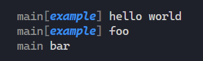

# @cuppachino/logger

Tiny logging utility for tiny projects. Enjoy colored console output without
overthinking it.

## 📦 Installation

[@cuppachino/logger](https://www.npmjs.com/package/@cuppachino/logger)

```ps
pnpm add -P @cuppachino/logger
```

```ps
npm install --save-prod @cuppachino/logger
```

## 🔍 Example Usage

```ts
import { createLogger } from '@cuppachino/logger'

const logger = createLogger('main' /* Options */)

logger.tag('example', 'blue', 'bold', 'italic').log('hello world')
logger.log('foo').untag()
logger.log('bar')
```



## 🛠️ Configuration

- `colors`: an array of colors/modifiers from `chalk` applied to the logger's
  prefix (default: `'gray'`).
- `tagWrapColors`: an array of colors/modifiers applied to the characters that
  wrap each tag (default: `'dim'`).
- `tagWrapStyle`: the characters used to wrap each tag (default: `'square'`).

```ts
type LoggerOptions = {
	colors: Color[]
	tagWrapColors: Color[]
	tagWrapStyle: WrapStyle
	// "angled" | "square" | "curly" | "parens"
}
```

## 💪 Methods

- `tag`: pushes a tag to the stack
- `untag`: removes the previous tag from the stack.
- `log`: writes a message to the console, prepended by the logger prefix and any
  tags.
- `error`: throws an error

---

## ✏️ Todo

```ts
/*
- transports
- levels-like filtering with tags (ideally avoid upfront logger config)
- maybe more... 
*/
```
